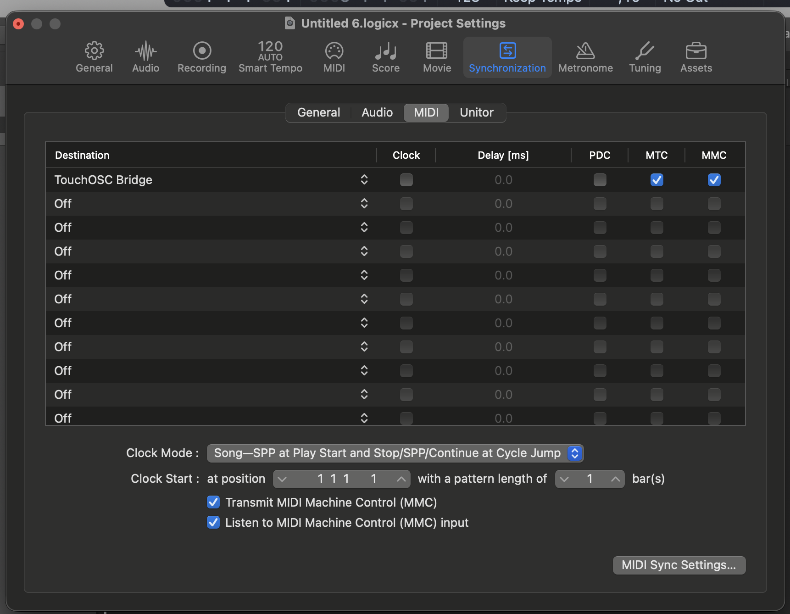

# MTC Movie Slate for TouchOSC

TouchOSC Mk2 layout with MIDI Timecode display and Recording Light integration.

## Features

- **MTC Display** — Receives MIDI Timecode (Quarter-Frame + Full Frame) and displays `HH:MM:SS:FF`
- **Recording Light** — Detects recording state via MIDI Notes and shows visual feedback
- **OSC Bridge** — Sends recording state via OSC to external bridge (for Shelly/recording light control)

## Prerequisites

- Logic Pro
- [TouchOSC Bridge](https://hexler.net/touchosc/bridge-releases)
- [TouchOSC](https://hexler.net/touchosc/releases)

## Setup Logic Pro for transmitting MTC

The timecode display will only work, if it is transferred to the TouchOSC Bridge. If you want to use the stop, recording, start buttons within the TouchOSC UI you need to activate MIDI Machine Control (MMC).



## MIDI Notes (from Logic Pro Recording Light)

| Note | Vel | Meaning |
|------|-----|---------|
| 24   | 127 | Track armed for recording (Record Ready → blinks) |
| 24   | 0   | Record Ready disabled |
| 25   | 127 | Recording active (steady on) |
| 25   | 0   | Recording stopped |

## OSC Integration

The Lua script in the layout sends OSC messages on recording state changes:

| OSC Address | Value | Meaning |
|-------------|-------|---------|
| `/recording/state` | 0 | Idle (light off) |
| `/recording/state` | 1 | Armed (light blinks) |
| `/recording/state` | 2 | Recording (light on) |
| `/recording/light` | 0/1 | Simplified light state |

Incoming OSC (from bridge, for manual testing):

| OSC Address | Value | Effect |
|-------------|-------|--------|
| `/recording/light/set` | 0 | Light off |
| `/recording/light/set` | 1 | Light on (recording) |
| `/recording/light/set` | 2 | Light blink (armed) |

### Configuring TouchOSC OSC Connection

1. **Connections** → enable **OSC 1**
2. **Host:** IP address of the Mac running the bridge (`bridge.py`)
3. **Send Port:** `9000`
4. **Type:** UDP

The bridge (`bridge.py`) forwards OSC → MQTT → Shelly.
See: [recording-light-shelly](https://github.com/muellera/recording-light-shelly) project.

## MMC Format (reference)

```
F0 7F <Device-ID> <Sub-ID#1> [<Sub-ID#2> [<parameters>]] F7
```

- `7F` = deviceID (all devices)
- `06` = subId1 (MMC Machine Control Command)

## Detect Bonjour Services

```bash
dns-sd -B _osc._udp
```

Details for a specific service:

```bash
dns-sd -L "My-iPhone" _osc._tcp local
```
